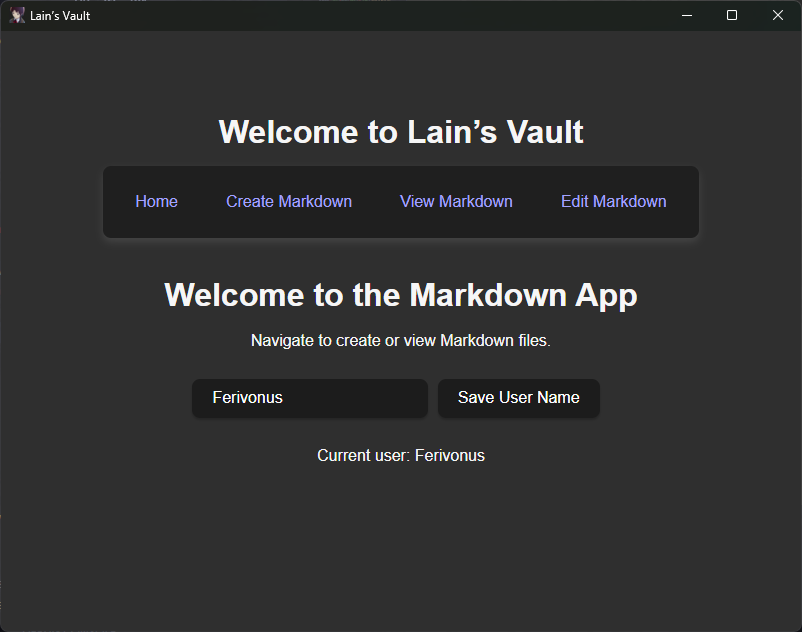
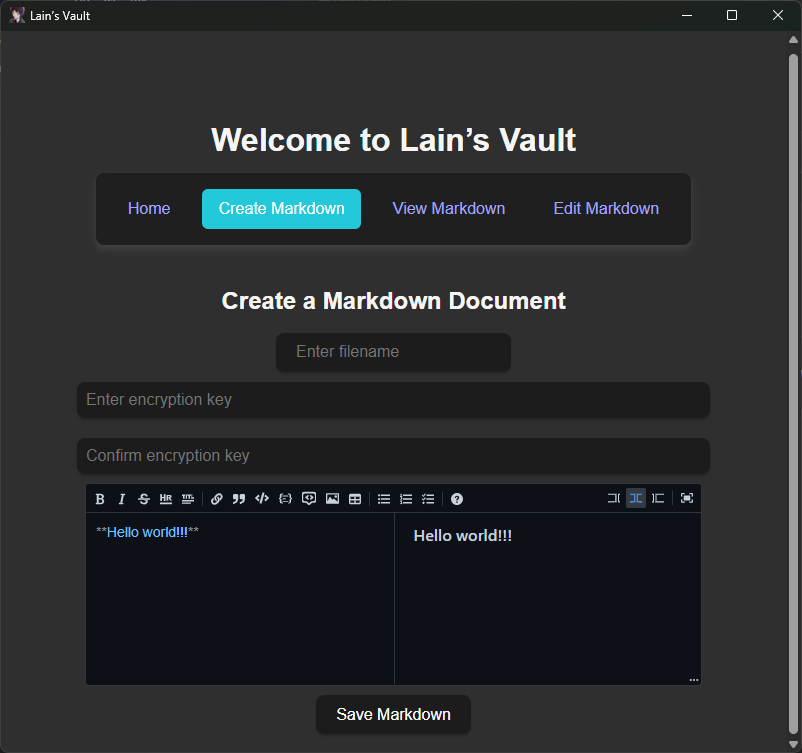
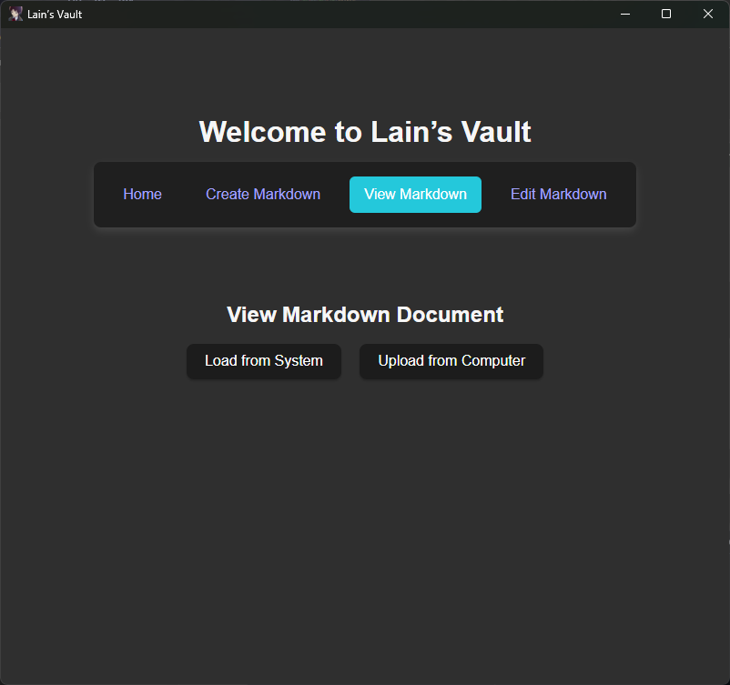
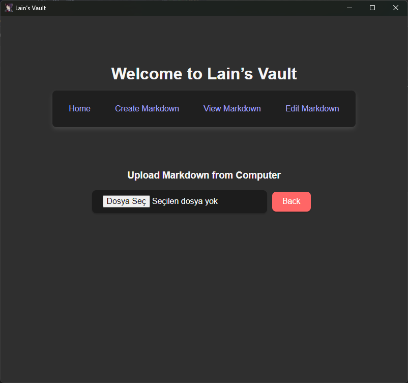
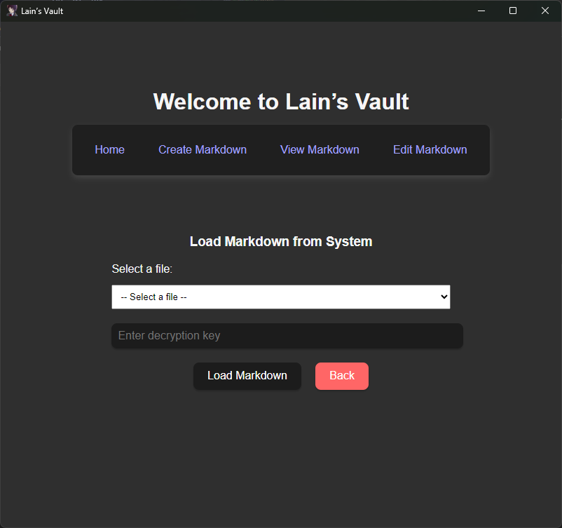
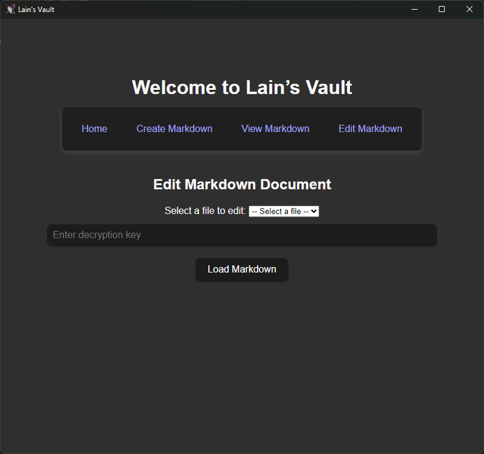

# Lain’s Vault

## Overview

Lain’s Vault is a Tauri and React-based application designed to help users securely create, view, and manage Markdown files. It offers features to load Markdown documents from the system and upload local files while ensuring that sensitive information is encrypted and securely handled.

## Features

- Create and edit Markdown files.
- Load existing Markdown documents from the system.
- Upload local Markdown files for viewing.
- Securely manage content with optional encryption (coming soon as an integrated C# module for added security).

## Technologies Used

- **Tauri**: A framework for building smaller, faster, and more secure desktop applications using web technologies.
- **React**: A JavaScript library for building user interfaces, allowing for efficient rendering of components.
- **Markdown Editor**: Integrated Markdown editing capabilities for a seamless user experience.

## Usage

- Start the application by entering a unique name. This name will be used to create a dedicated folder for storing your Markdown documents.
- All Markdown files you create or edit will be associated with this name. Files are stored within the named folder, keeping documents separated by user or project.
- When you switch to a new name, only the documents associated with that new name will be visible, and files created under the previous name will not appear until you switch back.
- Once started, you'll be greeted with options to either load Markdown from your system or upload a new file.
- Follow the prompts to manage your Markdown documents with ease.

# Application Screenshots

## Home Page


The homepage provides quick access to the main features of the application.

## Markdown Creation Page


This page allows users to create new Markdown files.

## Markdown Viewing Page

Here, users can view Markdown files.

1. Main Markdown Viewing Page:


2. Program's Markdown Viewing Page:


3. Computer's other Markdown Viewing Page:


users can open their Markdown files from their computer's too.

## Markdown edit Page



Here, users can edit Markdown files.

## Getting Started

### Prerequisites

Ensure you have the following installed on your machine:

- Node.js
- Tauri CLI
- Yarn or npm
- Rust (for the Tauri backend)

### Installation

1. Clone the repository:

    ```bash
    git clone https://github.com/Ferivonus/Markdown-protector.git
    cd Markdown-protector
    ```

2. Install dependencies:

    ```bash
    npm install
    ```

3. Run the application:

    ```bash
    npm run tauri dev
    ```

## License

This project is licensed under the MIT License - see the LICENSE file for details.

## Contact

For questions or feedback, please reach out to <ferivonus@gmail.com>.
